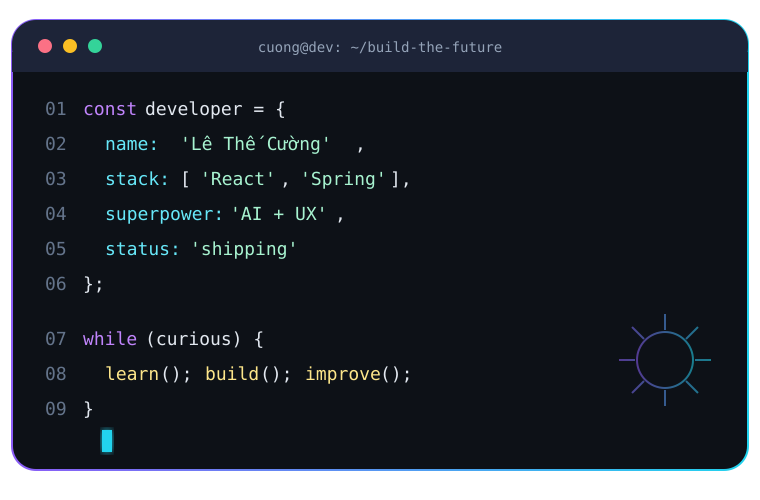
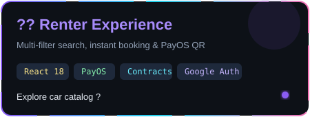
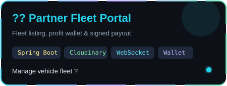
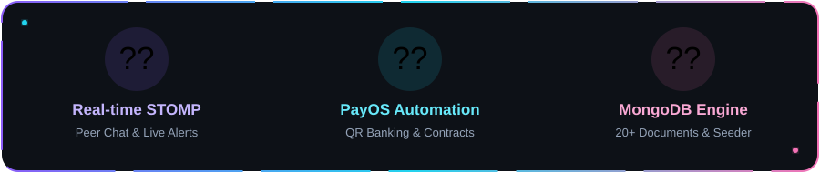
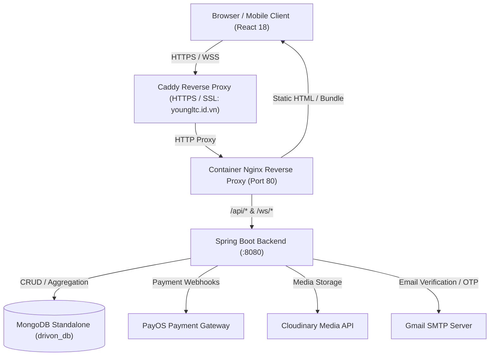

<div align="center">


[](https://git.io/typing-svg)

[](https://youngltc.id.vn)
[](https://ltcuong24.id.vn)
[](mailto:lethecuong2k4@gmail.com)
[](https://github.com/ekancisme?tab=followers)

</div>



### `> project_spec`

```yaml
project: Drivon (Car Rental & Fleet Management Ecosystem)
author: Lê Thế Cường
role: Full-stack Developer
education: Software Engineering @ FPT University Đà Nẵng
location: Đà Nẵng, Việt Nam
stack:
  backend: Java 17, Spring Boot 3, Spring Security, MongoDB
  frontend: React 18, Tailwind CSS, Lucide Icons, WebSocket STOMP
  integrations: PayOS Payment Gateway, Cloudinary Media, Gmail SMTP
  infrastructure: Docker, Nginx Reverse Proxy, Caddy Auto-HTTPS
live_demo: https://youngltc.id.vn
```

- High-performance vehicle rental and fleet management platform connecting Renters, Car Owners, and Admins.
- Engineered with high-throughput Spring Data MongoDB persistence, sequence generators, and sparse indexing.
- Features real-time bidirectional chat, instant notifications, PayOS QR payments, and digital contract signing.
- Containerized via multi-stage Docker builds and deployed with Caddy automated SSL reverse proxy.

<br clear="both" />


## ⚡ Tech constellation

<div align="center">

[](https://skillicons.dev)


</div>

## 🚀 Featured modules

<table>
<tr>
<td width="50%" valign="top">

### 🚗 [Customer Rental Experience](https://youngltc.id.vn)

Smart vehicle search with multi-criteria filters.<br />
Interactive booking engine with instant price estimation.<br />
Seamless PayOS QR banking checkout and digital contracts.

`React 18` `Tailwind` `PayOS`<br />
`MongoDB` `Google OAuth` `Email OTP`

<a href="https://youngltc.id.vn"></a>

</td>
<td width="50%" valign="top">

### 💼 [Owner Partner & Fleet Portal](https://youngltc.id.vn)

Complete vehicle management and photo uploads.<br />
Live revenue dashboard, profit tracking, and debt calculation.<br />
Withdrawal requests with digital signature validation.

`Spring Boot 3` `Spring Security` `Cloudinary`<br />
`STOMP WebSocket` `Digital Signature` `JWT`

<a href="https://youngltc.id.vn"></a>

</td>
</tr>
</table>

## 🏆 System Highlights & Capabilities

<div align="center">



</div>

<details>
<summary><b>🎯 Core Architecture & Flow Diagram</b></summary>
<br />



### Key Architectural Pillars:
1. **Document Database with Sequential IDs:** Custom `SequenceGeneratorService` and `MongoModelListener` ensure safe auto-increment IDs for relational-style entities (Users, Bookings, Contracts, Payments, Reviews).
2. **Stateless Security:** JWT authentication coupled with Google OAuth 2.0 and Spring Security 6 authorization filters.
3. **Real-time Bidirectional Mesh:** WebSocket STOMP message broker handling concurrent peer-to-peer chats and system broadcasts.
4. **Unified Multi-Stage Docker Container:** React production bundle served directly by Nginx with internal reverse proxy to Spring Boot.

</details>

<details>
<summary><b>🛠️ Quick Start & Local Development</b></summary>
<br />

### Prerequisites
- **Java JDK 17+**
- **Node.js 18+** & **npm**
- **MongoDB 6+** (Running locally on `mongodb://localhost:27017` or MongoDB Atlas)

### 1. Backend Setup
```bash
cd backend

# Configure application.properties with your MongoDB URI, JWT Secret, and Gmail SMTP
# Run Spring Boot backend (Starts at http://localhost:8080)
./mvnw clean spring-boot:run
```

### 2. Frontend Setup
```bash
cd frontend

# Install dependencies
npm install --legacy-peer-deps

# Start React development server (Starts at http://localhost:3000)
npm start
```

</details>

<details>
<summary><b>🚢 Production VPS Deployment</b></summary>
<br />

Deploying Drivon to any Linux VPS using Docker and Caddy:

```powershell
# Run the automated deployment script
.\deploy.ps1 -AppName "drivon-app" -Domain "youngltc.id.vn" -ContainerPort 80
```

The automated pipeline executes:
1. Source packaging excluding dependencies and dev cache.
2. Transferring tarball to remote VPS via SSH/SCP.
3. Building the optimized multi-stage Docker image on the server.
4. Starting `drivon-app` container on the `web-net` Docker network.
5. Updating Caddy reverse proxy routing with zero-downtime SSL certificate reloading.

</details>

<details>
<summary><b>🎮 A Tiny Developer Quest</b></summary>
<br />

```text
MISSION       Deliver robust, scalable, high-performance web experiences
PROJECT       Drivon Car Rental & Fleet Ecosystem
DEVELOPER     Lê Thế Cường (@ekancisme)
TECH POWER    Java 17 · Spring Boot 3 · MongoDB · React · Docker
PARTY MODE    Teamwork · Agile/Scrum · Clean Code · Code Review
NEXT LEVEL    Scalable Distributed Systems & AI Integration
```

</details>

<div align="center">

### 💬 Let's build something memorable

[](https://youngltc.id.vn)
[](https://ltcuong24.id.vn)
[](mailto:lethecuong2k4@gmail.com)


<sub>Designed with code, curiosity and a slightly unreasonable number of animations.</sub>

</div>
