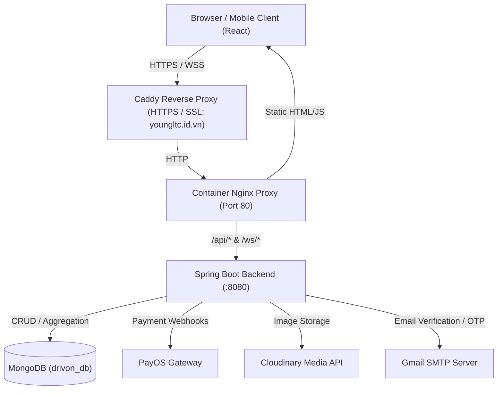

<div align="center">

# ?? DRIVON

### **Next-Gen Full-Stack Car Rental & Fleet Management Platform**

[](https://git.io/typing-svg)

<p align="center">
  <a href="https://youngltc.id.vn">
    
  </a>
  <a href="https://github.com/ekancisme/drivon">
    
  </a>
  <a href="https://ltcuong24.id.vn">
    
  </a>
  <a href="mailto:lethecuong2k4@gmail.com">
    
  </a>
</p>

</div>

---

## ?? Overview

**Drivon** is a modern, full-stack vehicle rental and fleet management ecosystem built for seamless interactions across three core user roles: **Customers (Renters)**, **Car Owners (Partners)**, and **System Administrators**. 

Engineered with high performance and enterprise-grade reliability, Drivon combines **Spring Boot 3** and **MongoDB** on the backend with a responsive **React** frontend, supporting real-time WebSocket communication, PayOS payment automation, KYC document verification, and dynamic contract generation.

---

## ? Tech Constellation

<div align="center">

[](https://skillicons.dev)

</div>

<div align="center">

| Layer | Technologies & Frameworks |
| :--- | :--- |
| **Backend Core** | `Java 17` · `Spring Boot 3.1.5` · `Spring Data MongoDB` · `Maven` |
| **Security & Auth** | `Spring Security 6` · `JWT (JSON Web Token)` · `Google OAuth 2.0` · `BCrypt` |
| **Frontend UI** | `React 18` · `React Router v6` · `Tailwind CSS / Lucide Icons` · `Axios` |
| **Real-time & Socket** | `Spring WebSocket` · `STOMP Protocol` · `SockJS` |
| **Cloud & Storage** | `MongoDB Standalone / Replica` · `Cloudinary Media API` |
| **Payments & Integrations**| `PayOS Payment Gateway` · `Gmail SMTP Mailer` · `Digital Signature` |
| **DevOps & Infrastructure**| `Docker (Multi-stage build)` · `Nginx Reverse Proxy` · `Caddy SSL Proxy` |

</div>

---

## ?? Key Features

<table>
<tr>
<td width="50%" valign="top">

### ?? Customer Experience (Renter)
- **Smart Vehicle Search:** Multi-criteria filtering by brand, fuel type, transmission, seating capacity, price range, and city location.
- **Instant Booking Engine:** Interactive schedule picker, pricing calculation, discount coupon application, and PayOS QR banking checkout.
- **Digital Rental Contracts:** Automated generation and viewing of rental contracts with legal terms.
- **Review & Ratings:** Real-time feedback and star rating system for cars and rental experiences.

</td>
<td width="50%" valign="top">

### ?? Car Owner Portal (Partner)
- **Fleet Management:** Register new vehicles, upload multi-angle photos & cavet verification documents via Cloudinary.
- **Revenue & Wallet Dashboard:** Live tracking of earnings, profit margins, rental history, and total debt.
- **Withdrawal Requests:** Create cash-out requests with digital signature validation and bank account routing.
- **Direct Communication:** Real-time STOMP messaging directly with renters for pickup arrangements.

</td>
</tr>
<tr>
<td width="50%" valign="top">

### ??? Admin Command Center
- **Fleet Verification:** Review and approve/reject partner vehicle listings and KYC identity documents.
- **System Revenue Analytics:** Real-time charts of gross revenue, platform commission fees, and active rentals.
- **User Management:** Granular role assignment, account ban/active toggling, and partner verification.
- **System Broadcasts:** Send targeted or platform-wide notifications and promotional announcements.

</td>
<td width="50%" valign="top">

### ? Infrastructure & Architecture
- **Document-based Persistence:** High-throughput MongoDB schema with sequence generators and sparse indexes.
- **Enterprise Security:** JWT-based stateless authentication, Google OAuth 2.0 single sign-on, and email OTP verification.
- **Unified Containerization:** Single-container deployment bundling React static build, Spring Boot API, and Nginx proxy.
- **Automatic SSL & Reverse Proxy:** Zero-config HTTPS with Caddy reverse proxy integration.

</td>
</tr>
</table>

---

## ??? System Architecture



---

## ?? Project Structure

```text
drivon/
+-- backend/
¦   +-- src/main/java/Drivon/backend/
¦   ¦   +-- config/          # Security, JWT, MongoListener, MongoDataSeeder, WebSocket
¦   ¦   +-- controller/      # REST API Endpoints (Auth, Car, Booking, Payment, Admin, ...)
¦   ¦   +-- dto/             # Data Transfer Objects & PayOS request/response models
¦   ¦   +-- entity/          # Chat, Message, Notification MongoDB Documents
¦   ¦   +-- model/           # User, Car, Booking, Contract, Review Documents
¦   ¦   +-- repository/      # Spring Data MongoRepository Interfaces
¦   ¦   +-- service/         # Business logic, SequenceGenerator, EmailService, PayOS
¦   +-- src/main/resources/
¦       +-- application.properties
¦       +-- db.sql           # Initial relational reference schema
+-- frontend/
¦   +-- public/              # Index HTML, Favicons, Static Assets
¦   +-- src/
¦       +-- api/             # Dynamic API & WebSocket configuration
¦       +-- components/      # Modular UI components (Auth, Car, Admin, Partner, Profile)
¦       +-- contexts/        # React Contexts (User, Car, Partner, Booking, History)
¦       +-- services/        # WebSocket STOMP service
+-- Dockerfile               # Multi-stage production container build
+-- nginx.conf               # High-performance Nginx API & Static reverse proxy
+-- entrypoint.sh            # Container init runner for Java + Nginx
+-- deploy.ps1               # Automated VPS deployment script
+-- README.md
```

---

## ??? Quick Start & Local Development

### Prerequisites
- **Java JDK 17+**
- **Node.js 18+** & **npm**
- **MongoDB 6+** (Running locally on `mongodb://localhost:27017` or MongoDB Atlas)

### 1. Backend Setup
```bash
cd backend

# Configure application.properties with your MongoDB URI, JWT Secret, and Gmail SMTP
# Run Spring Boot backend (Starts at http://localhost:8080)
./mvnw clean spring-boot:run
```

### 2. Frontend Setup
```bash
cd frontend

# Install dependencies
npm install --legacy-peer-deps

# Start React development server (Starts at http://localhost:3000)
npm start
```

---

## ?? Production VPS Deployment

Deploying Drivon to any Linux VPS using Docker and Caddy:

```powershell
# Run the automated deployment script
.\deploy.ps1 -AppName "drivon-app" -Domain "youngltc.id.vn" -ContainerPort 80
```

The deployment pipeline automatically:
1. Archives source code excluding dev cache.
2. Transfers bundle to VPS over SSH.
3. Builds the optimized multi-stage Docker image on the server.
4. Spins up `drivon-app` on the `web-net` bridge network.
5. Injects the domain reverse proxy configuration into Caddy and reloads SSL certificates.

---

## ?? Author

<div align="center">

**Lê Th? Cu?ng**  
*Full-stack Developer · Software Engineering @ FPT University Ðà N?ng*

[](https://ltcuong24.id.vn)
[](https://github.com/ekancisme)
[](mailto:lethecuong2k4@gmail.com)

</div>

---

<div align="center">

<sub>Built with curiosity, clean code, and passion for scalable engineering.</sub>

</div>